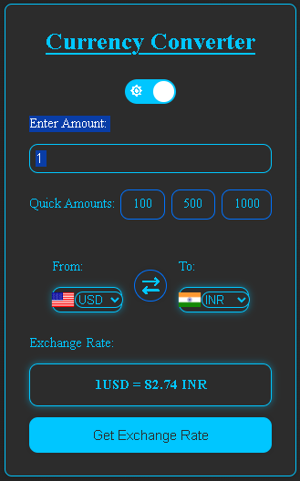

# 💱 Currency Converter

A responsive **Currency Converter Web App** built with HTML, CSS, and JavaScript. It uses a live exchange rate API to convert currencies and displays the corresponding country flags.

---

## 🚀 Live Demo

**[Check it out here](https://itsabubakar786.github.io/Currency-Converter/)**

---

## ✨ Features

- 💱 Live currency conversion
- 🌐 Multiple currency support
- 🇺🇸 Country flags
- 🔄 Currency swap
- 💰 Quick amount buttons
- 🌙 Dark / ☀️ Light Mode
- 📱 Responsive design
- ⚡ Loading state
- ⚠️ Basic API error handling

---

## 🛠️ Tech Stack

- **HTML5**
- **CSS3**
- **JavaScript (ES6+)**
- **Fetch API**
- **Currency API**
- **Font Awesome**
- **FlagsAPI**

---

## 🔌 API

Exchange rates are provided by **Currency API by Fawaz Ahmed**.

🔗 https://github.com/fawazahmed0/exchange-api

Example:

```text
USD → INR
```

---

## 📂 Project Structure

```text
Currency-Converter/
│
├── index.html
├── style.css
├── script.js
├── preview.png
└── README.md
```

---

## 🧠 What I Learned

- Working with APIs and JSON
- `fetch()` and `async/await`
- DOM manipulation
- Event listeners
- Dynamic UI updates
- Responsive CSS
- Dark / Light theme
- Basic error handling

---

## 🔮 Future Improvements

- 📊 Exchange rate charts
- 🕐 Conversion history
- ⭐ Favorite currencies
- 📋 Copy conversion result
- 💾 Save user preferences

---

## 📸 Preview



---

## 👨‍💻 Author

**Abubakar**  
B.Sc. Information Technology Student

- 💼 LinkedIn: Add your profile
- 🐙 GitHub: Add your profile

---

⭐ **If you like this project, consider giving it a star!**

**Built with HTML, CSS & JavaScript ❤️**
